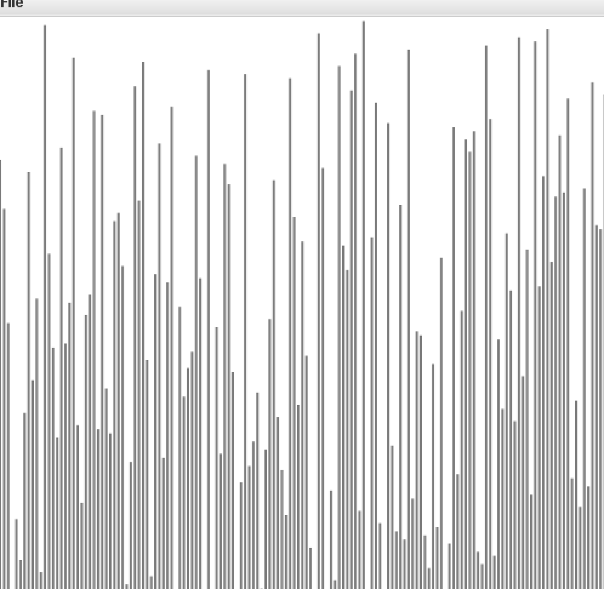

### 排序算法

#### Example
[Example类](https://github.com/SunDDD/Sort/blob/master/src/com/algorithms/sort/Example.java)为模板类，
不实现具体排序功能，但是提供了如判断数组是否有序，提供测试数据等功能，同时提供了less方法和exch方法实现了
两个元素之间的判断大小以及交换数组元素的功能，提高了代码的可读性，之后的所有排序算法均继承了该类。

``` less
    /**
     * 判断 v 是否小于 w 如果是返回true,否则返回false;
     * v , w 均为实现Comparable接口的对象
     * @param v
     * @param w
     * @return
     */
    public static boolean less(Comparable v, Comparable w) {
        return v.compareTo(w) < 0;
    }
```

``` exch
    /**
     * 交换数组Comparable[] a中i, j位置的数据
     * @param a
     * @param i
     * @param j
     */
    public static void exch(Comparable[] a, int i, int j) {
        Comparable t = a[i];
        a[i] = a[j];
        a[j] = t;
    }
```

本排序算法由参考了
> 算法（第四版）

该书提供了一个工具类实现标准输入、输出、可视化工具等，下载地址为[algs4.jar](http://www.crits.site/download/algs4.jar)，
运行代码时需要将jar包导入到工作空间中，IDEA可参考本人博客[IDEA配置](http://www.crits.site/2018/07/02/IDEA配置/)

任何实现了Comparable接口的数组都可以通过使用Example类的子排序类进行排序，
常用的数据类型如String,Integer等都已经实现了Comparable接口。
自定义的类如需使用排序算法，只需要实现Comparable接口即可，如以下的Date类
```code
public class Date implements Comparable<Date>{

    private final int day;
    private final int month;
    private final int year;

    public Date(int year, int month, int day) {
        this.day = day;
        this.month = month;
        this.year = year;
    }

    @Override
    public int compareTo(Date that) {
        if (this.year > that.year) return +1;
        if (this.year < that.year) return -1;
        if (this.month > that.month) return +1;
        if (this.month < that.month) return -1;
        if (this.day > that.day) return +1;
        if (this.day < that.day) return -1;
        return 0;
    }
    
}
```
Example类的主函数提供了一个测试方法，可以在在其中更换排序方法如Selection.sort(), Merge.sort()等，检验算法的正确性，

---

#### 选择排序
首先介绍最简单的排序：选择排序，该排序的工作方法是: 
找到数组中最小的元素，放在第一位，接着找到第二小的元素放在第二位，以此类推，直到数组最后一位
为止。具体实现方法也很简单，在外层循环中进行从第一位到最后一位的遍历，之后在内层循环中找到剩下
元素中最小值，并与未排序的第一位进行交换。实现方法为：
[SelectionSort类](https://github.com/SunDDD/Sort/blob/master/src/com/algorithms/sort/selection/SelectionSort.java)中的sort方法. <br>

##### 核心代码
```
    public static void sort(Comparable[] a) {
        /*将a[]按升序排列*/
        int N = a.length; //数组长度
        for (int i = 0; i < N; i++) {
            /*将a[i]和a[i + 1] ~ a[N - 1]中最小的元素交换 */
            int min = i;  //最小元素索引
            for (int j = i + 1; j < N; j++) {
                if (less(a[j], a[min])) {
                    min = j;
                }
            }
            exch(a, min ,i);
        }
    }
```


##### 时间按复杂度
对于长度为N的数组，易得选择排序大约需要N²/2次比较和N次交换，所以时间复杂度为O(N²)

##### 算法特点
选择排序有两个鲜明的特点：
1. 运行时间和输入无关。根据选择排序的原理，可以很清楚的得到每次扫描不能为下一次扫描提供任何信息
即任何长度相同的数组比较次数都是一样的，一个已经有序或者主键都相同的数组排序时间与完全随机的数组
排序时间相同。
2. 数据移动最少。根据实现方法可知，选择排序的数据交换次数与数组的大小是线性关系，即对于长度为N的数组
使用选择排序进行排序，交换次数为N，这个性质是其他的排序算法不具备的。

##### 算法可视化
以下是20个元素的样本交换示意图，同时该图像的实现过程也在SelectionSort类的主函数中给出。
其中红色为两个元素即将进行交换，粉色该元素与自己进行交换，灰色为未参与交换，但需要注意的是
灰色元素参与了比较。
<div align="center">
    
</div>

---

#### 插入排序
想象整理一种花色13张扑克牌，开始的时候是随机排列的，从第一张开始，显然一张扑克牌是有序的，
接着看第二张，根据顺序可以把第二张放在第一张的左边或者右边（根据大小），接着第三张，第四张;
直到顺序排列完成，该方法通过计算机实现就是插入排序，通过外层循环i实现已经有序的元素标记，
再通过内层循环j向左运行，判断左边的元素是否大于位置j的元素，大于则交换并于交换后的左边元素
进行比较，直到到达左边元素小于它的位置，完成一轮插入。全部元素插入成功，则数组排序完毕。
[InsertionSort类](https://github.com/SunDDD/Sort/blob/master/src/com/algorithms/sort/insert/InsertionSort.java)

##### 核心代码
```
    public static void sort(Comparable[] a) {
        
        int N = a.length;
        for (int i = 1; i < N; i++) {
            
            for (int j = i; j >= 1 && less(a[j], a[j - 1]); j--) {
                exch(a, j, j - 1);
            }
            
        }
        
    }
```

##### 时间复杂度
完全随机的且主键都不同的数组，每个元素需要移动的平均距离为该元素到数组首元素的一半，所以平均情况下
插入排序需要~N²/4次比较和~N²/4次交换
###### 最坏情况
最坏情况就是数组为主键不同的倒序，此时需要~N²/2次比较和~N²/2交换，每一位都移动到已排序
元素的最左边，比较次数与选择排序相同，但是因为有很多次交换次数，时间上相较选择排序慢
很多，实际使用中绝对要避免这种情况
###### 最好情况
最好情况就是已排序的数组，实际使用中只需要N-1次比较和0次交换就可以完成排序，计算时间与N
成正比，与之做对比的是选择排序，已经有序的数组排序时间仍然与N²成正比，显然插入排序对原数组
的顺序利用的很好
###### 综合
插入排序的时间复杂度与选择排序一样为O(N²)，但是实际使用上速度大约是选择排序的一倍，对于已经有序
或者大致有序的数组性能甚至比其他时间复杂度为O(NlogN)的排序算法更快，同时该算法对小型数组的
支持也很好，事实上很多高级的排序算法在处理小规模数组部分的时候也使用了插入排序。总之它的性能相较选择排序提升很大

#### 算法可视化
同样是20个元素的交换，红色代表当前需要插入的元素，每次红色移动说明它小于左边的元素，将要
与其左边元素进行交换；黑色代表已经有序的元素，灰色代表
它们还未参与排序，开始所有元素都未参与排序，所以是灰色的，排序完成后都为黑色，说明已经
完成排序。该段选择排序的实现在InsertionSort类的主函数中中，通过传入参数实现颜色的变化。

首先是一个部分有序的数组使用插入排序。

<div align="center">
    
</div>

我们可以看到对于大致有序的数组，它的排序速度很快。再看完全随机的数组。

<div align="center">
    
</div>

对于一般情况，后面元素的
移动**次数**（注意，不是距离）相较前面的元素多，而每一次移动都代表了一次比较和一次交换，直接影响了排序的时间，
我们可不可以快速移动后面的元素使数组大致有序（类似第一张图片的初始状态），再使用普通的插入排序加快排序速度呢？ 
答案是可以，下一个排序算法就实现了这种猜想。

---

#### 希尔排序
插入排序的最后提出了一个假设，能否先进行大幅度的移动，再利用插入排序在
数组大致有序时效率高的特性提高排序速度，希尔排序实现了这一目标。希尔排序引入了h-排序，即
通过与当前元素前面h位进行比较，根据结果决定是否交换，该方法与插入排序很像，只不过插入排序的h值为1。
以下是h=4时的h-排序：

**h=4**

                        S O R T E X A M P L E
                        S-------E-------P            ->E P S
                          O-------X-------L          ->L O X
                            R-------A-------E        ->A E R
                              T-------M              ->M T
经过h=4排序后的数组为  E L A M P O E T S X R
相较未排序的数组，有序性得到了提高，同时，因为h较大，进行的比较次数和交换次数也较小，
当h=1时，排序算法变为了插入排序，当插入排序完成时，数组严格有序，又因为
已经进行过h=4排序，此时数组已大致有序，插入排序的效果很好，这就是希尔排序的原理，总结起来
就是通过大幅度的移动使数组实现大致有序，最后通过插入排序实现数组严格有序。

接下来就是确定h的常数列，常用3x + 1 (x = 1, 2, 3)， 即1， 4， 13， 40 ，121等等
大多数情况下该组数字表现很好。 
[ShellSort类](https://github.com/SunDDD/Sort/blob/master/src/com/algorithms/sort/shell/ShellSort.java)

```
    public static void sort(Comparable[] a) {

        int h = 1;
        int N = a.length;

        while (h < N / 3) {
            //h的取值为1, 4, 13, 40, 121, 364,1093...
            h = h * 3 + 1;
        }

        while (h >= 1) {

            for (int i = h; i < N; i++) {
                //将a[i]插入到a[i - h], a[i - 2 * h], a[i - 3 * h]...之中
                for (int j = i; j >= h && less(a[j], a[j - h]); j--) {
                    //内层循环当h等于1时，与插入排序相同
                    exch(a, j, j - h);
                }
            }

            //每完成一次h-排序就把h变为h/3
            h = h / 3;
        }

    }
```


##### 时间复杂度
3x + 1最坏的情况下为O(N的3/2次方)，实际使用比这个快很多，大概为NlogN的若干倍，希尔排序
的时间复杂度不固定，但是肯定的是它一定比N²小，且没有人能证明没有一组常数列使得希尔排序
的时间复杂度为NlogN甚至更低。实际使用时不需要考虑这么多，只需要知道它在某些情况下
比一些经典的，时间复杂度为O(NlogN)的排序算法更快就好。

##### 特性
1. 实现方法简单，思想也很简单，代码量低，适合使用在嵌入式设备等没有排序函数的设备中，
它在小规模数组的排序中令人满意，大数据量相较其他排序算法差距也不太大，大概是常数倍，
如果不能满足需要，再根据情况使用其他的排序算法。
2. 从插入排序到希尔排序只经过了小小的改变，却一举突破了平方级别的时间复杂度，而且没有
使用额外的空间，这正是许多算法设计的目标，即保持易用性的，易读性的同时提高效率。

##### 算法可视化
以下是150个元素使用希尔排序的图像，只记录每轮h-排序后的结果，颜色与h对应关系为
```
    Color color;
    if (h == 121) {
         color = StdDraw.RED;
    } else if (h == 40) {
        color = StdDraw.BLUE;
    } else if (h == 13) {
        color = StdDraw.PINK;
    } else if (h == 4) {
        color = StdDraw.GREEN;
    } else {
        color = StdDraw.BLACK;
    }
```

<div align="center">
    
</div>

可以清楚的看到每轮h-排序后，数组的有序性有会提高，在4-排序完成后，数组已经大致有序，
此时使用插入排序进行严格排序，排序速度远高于对随机数组进行排序。

#### 归并排序

所谓归并即将两个小的有序数组合并为一个大的有序数组，假设两个小数组首尾相连，形成一个非有序的数组，一种简单的实现方法：
1. 创建一个长度与数组相同的辅助数组，并把原数组的所有数据拷贝到辅助数组中。
2. 设置三个指针，i指向辅助数组中左子数组的的头，j指向辅助数组中右子数组的的头，k指向原数组已有序的末尾，开始为0。
3. 根据以下规则，向右移动k指针并在原数组中写入已经排序的元素。
      a. 如果i超过了左子数组的最大值(mid + 1)，则把右子数组剩下的元素依次写入原数组中，j超过最大值同理。
      b. 如果i，j均在原子数组中，则选择较小的元素写入原数组中并将较小元素所在数组的指针向右移动一位。
4. k指针移动到原数组最右边时，则说明一次归并完成，此时的数组为原两个子数组进行合并后的有序数组。
``` merge
    private static void merge(Comparable[] a, Comparable[] aux, int lo, int mid, int hi) {

        int i = lo;
        int j = mid + 1;
        //0. 两个有序子数组为a[lo]到a[mid]以及a[mid + 1]到a[hi]

        for (int k = lo; k <= hi; k++) {
            //1.拷贝原数组到辅助数组中
            aux[k] = a[k];
        }

        for (int k = lo; k <= hi; k++) {
            //2.根据规则进行归并
            if (i > mid) {
                a[k] = aux[j++];
            } else if (j > hi) {
                a[k] = aux[i++];
            } else if (less(aux[i], aux[j])) {
                a[k] = aux[i++];
            } else {
                a[k] = aux[j++];
            }
        }
    }
```

使用归并操作可以将两个小的有序数组合并为一个大的有序数组，想要获得小的有序数组我们可以将的小的有序数组分为更小的有序数组，
直到把数组分为一个元素，显然一个元素的数组肯定是有序的，此时再递归的返回小的有序数组直到数组有序，显然该思想可以使用递归
来实现，每一次调用归并算法前将数组分为两个子数组并进行排序，这种排序算法叫做归并排序。
``` sort
    public static void sort(Comparable[] a) {

        //1.创建辅助函数并通过参数调用传入到递归函数中
        Comparable[] aux = new Comparable[a.length];
        sort(a, aux, 0, a.length - 1);

    }

    private static void sort(Comparable[] a, Comparable[] aux, int lo, int hi) {

        //2.如果hi<=lo，则数组元素为1，必定有序
        if (hi <= lo) {
            return;
        }

        //3.取子数组中间值为分界线
        int mid = lo + (hi - lo) / 2;

        //4.将两个子数组排序
        sort(a, aux, lo, mid);
        sort(a, aux, mid + 1, hi);
        
        //5.使用归并算法将两个有子序数组合并为一个有序数组
        merge(a, aux, lo, mid, hi);

    }
```
实现：
[MergeSort类](https://github.com/SunDDD/Sort/blob/master/src/com/algorithms/sort/merge/MergeSort.java)

##### 时间复杂度
归并排序的时间复杂度与NlgN成正比，相较初级排序如选择、插入排序，它在大规模随机数组的表现强非常多。
<div align="center">
    
</div>
如10亿元素的数组在家用电脑使用插入排序进行排序需**317年**，而使用归并排序只需要**18**分钟，这是多么惊人的提高。

和希尔排序相比，实际使用中，他们的差距通常在常数级别（如使用3x + 1数列），但是具体性能仍取决于实现的方法以及数据。

##### 改进
归并算法仍有很多改进空间，具体实现在MergeSort类中的sortImproved方法，在此只给出改进思路。
1. 我们知道插入排序在小规模数组的表现良好，时间复杂度接近N，而归并排序在小规模数组的实现太过复杂，我们考虑在数组被分成长度
为5~10时使用插入排序，只需要改变递归函数中的返回条件即可，当 ```hi <= lo + 7``` 时，使用插入排序，再返回。
2. 考虑归并操作是否为必须，归并操作的目的是将两个已经有序的子数组合并为一个有序的数组。如果原数组已经有序，那就不需要进行归并操作了，
此时它的左子数组的最大值一定小于右子数组的最小值，判断该这两个数字，如果```a[mid] < a[mid + 1]```，则不需要进行下一步
归并，直接返回。

##### 变体
归并排序的思想是要将数组排序，需要得到两个有序的子数组，而原数组的子数组通常不是有序的，所以我们需要将子数组排序，而
子数组的子数组通常也不是有序的，还是需要将子数组的子数组进行排序，以此类推，是一种化整为零（然后递归的解决他们）的方式
解决问题。另一种思想是在开始阶段，我们就把数组两两分组，然后进行归并操作，此时每组都有序；然后每（两组）4个数字满足
归并操作的条件，即子数组有序，此时使用归并操作转化为一组4个数字的有序数组，此时每两组8个数字又满足了归并操作的条件
，以此类推，直到两组合并为一组，此时的数组已经有序了。这种实现方式被叫做自底向上的归并排序，与之对比的前面的实现方式
为自顶向下的归并排序。
``` sortBU
    public static void sortBU(Comparable[] a) {

        int N = a.length;
        Comparable[] aux = new Comparable[N];

        for (int sz = 1; sz < N; sz += sz) {

            for (int lo = 0; lo < N - sz; lo += sz + sz) {
                merge(a, aux, lo, lo + sz - 1, Math.min(N - 1, lo + sz + sz - 1));
            }
        }
    }
```
sz为子数组大小，最后一个子数组的大小只有只有数组大小是sz的偶数倍时才会等于sz（否则它会比sz小），所以判断归并上界时
取数组上界与理论上界里较小的数字。

整个排序方式为多次遍历数组，每次遍历时根据子数组大小进行两两归并（1 1 -> 2, 2 2 -> 4, 4 4 -> 8 .... ），归并成的数组大小为下次循环的
sz，初始值为1


              


