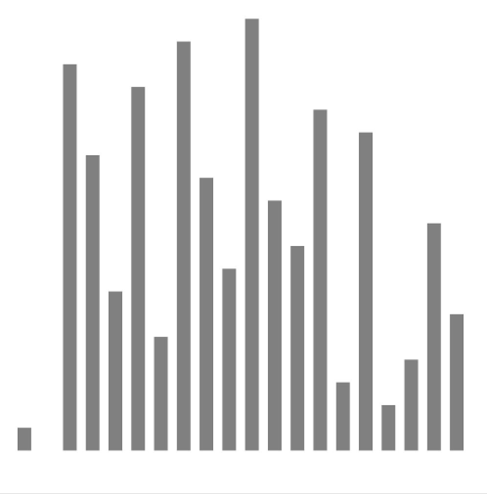
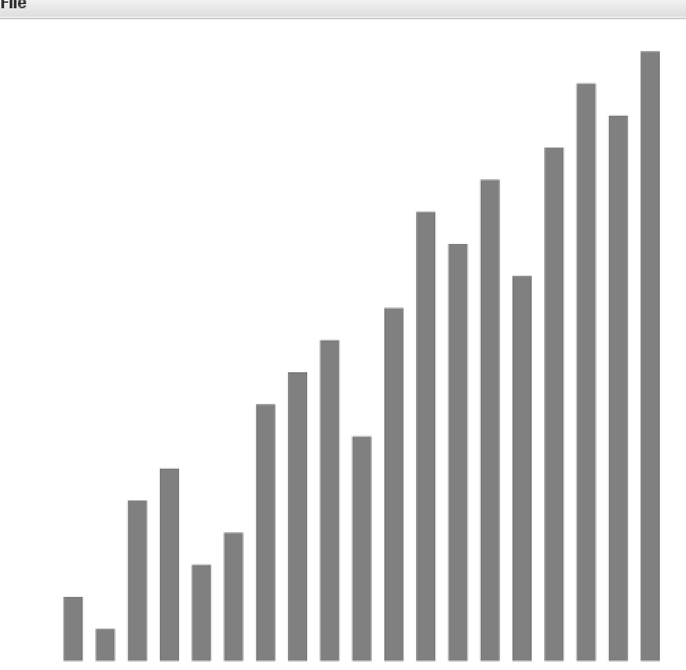
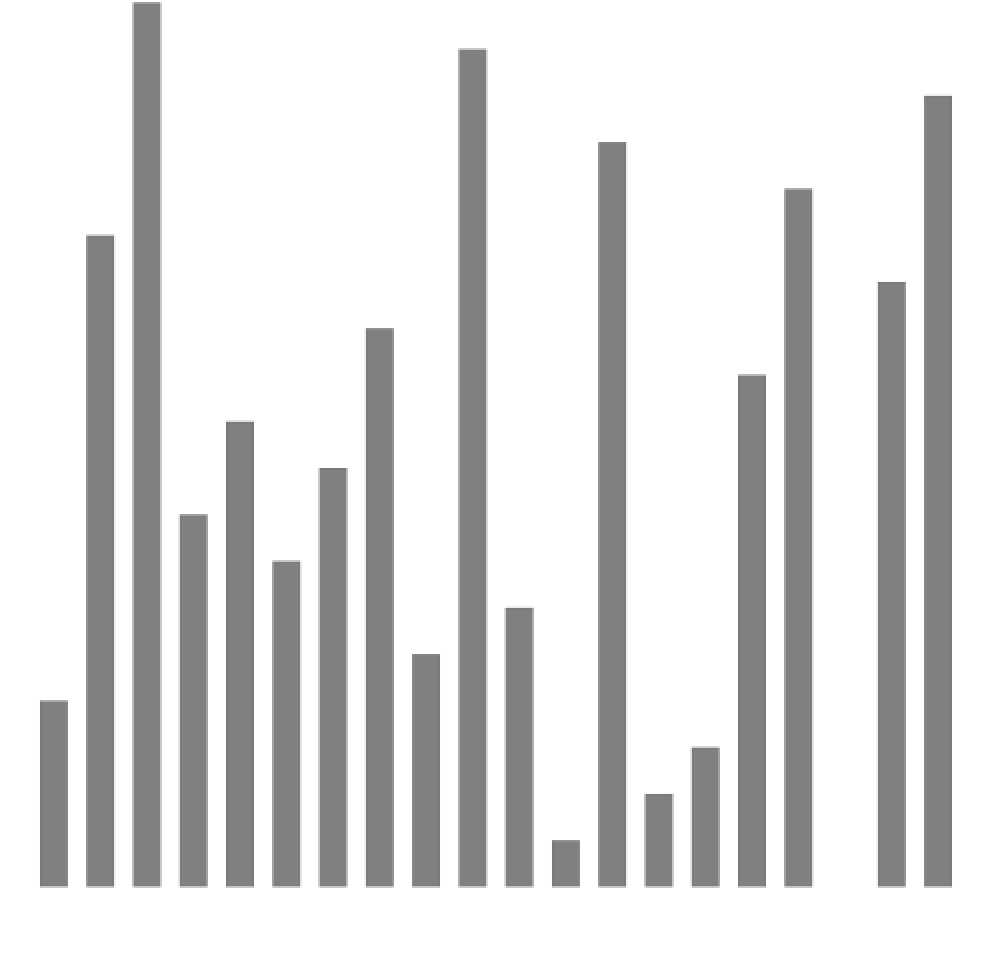

### 排序算法

#### Example
[Example类](https://github.com/SunDDD/Sort/blob/master/src/com/algorithms/sort/Example.java)为模板类，
不实现具体排序功能，但是提供了如判断数组是否有序，提供测试数据等功能，同时提供了less方法和exch方法实现了
两个元素之间的判断大小以及交换数组元素的功能，提高了代码的可读性，之后的所有排序算法均继承了该类。

``` less
    /**
     * 判断 v 是否小于 w 如果是返回true,否则返回false;
     * v , w 均为实现Comparable接口的对象
     * @param v
     * @param w
     * @return
     */
    public static boolean less(Comparable v, Comparable w) {
        return v.compareTo(w) < 0;
    }
```

``` exch
    public static void exch(Comparable[] a, int i, int j) {
        Comparable t = a[i];
        a[i] = a[j];
        a[j] = t;
    }
```

本排序算法由参考了
> 算法（第四版）

该书提供了一个工具类实现标准输入、输出、可视化工具等，下载地址为[algs4.jar](http://www.crits.site/download/algs4.jar)，
运行代码时需要将jar包导入到工作空间中，IDEA可参考本人博客[IDEA配置](http://www.crits.site/2018/07/02/IDEA配置/)

任何实现了Comparable接口的数组都可以通过使用Example类的子排序类进行排序，
常用的数据类型如String,Integer等都已经实现了Comparable接口。
自定义的类如需使用排序算法，只需要实现Comparable接口即可，如以下的Date类
```code
public class Date implements Comparable<Date>{

    private final int day;
    private final int month;
    private final int year;

    public Date(int year, int month, int day) {
        this.day = day;
        this.month = month;
        this.year = year;
    }

    @Override
    public int compareTo(Date that) {
        if (this.year > that.year) return +1;
        if (this.year < that.year) return -1;
        if (this.month > that.month) return +1;
        if (this.month < that.month) return -1;
        if (this.day > that.day) return +1;
        if (this.day < that.day) return -1;
        return 0;
    }
    
}
```
Example类的主函数提供了一个测试方法，可以在在其中更换排序方法如Selection.sort(), Merge.sort()等，检验算法的正确性，

---

#### 选择排序
首先介绍最简单的排序：选择排序，该排序的工作方法是: 
找到数组中最小的元素，放在第一位，接着找到第二小的元素放在第二位，以此类推，直到数组最后一位
为止。具体实现方法也很简单，在外层循环中进行从第一位到最后一位的遍历，之后在内层循环中找到剩下
元素中最小值，并与未排序的第一位进行交换。实现方法为：
[SelectionSort类](https://github.com/SunDDD/Sort/blob/master/src/com/algorithms/sort/selection/SelectionSort.java)中的sort方法. <br>

##### 核心代码
```
    public static void sort(Comparable[] a) {
        /*将a[]按升序排列*/
        int N = a.length; //数组长度
        for (int i = 0; i < N; i++) {
            /*将a[i]和a[i + 1] ~ a[N - 1]中最小的元素交换 */
            int min = i;  //最小元素索引
            for (int j = i + 1; j < N; j++) {
                if (less(a[j], a[min])) {
                    min = j;
                }
            }
            exch(a, min ,i);
        }
    }
```


##### 时间按复杂度
对于长度为N的数组，易得选择排序大约需要N²/2次比较和N次交换，所以时间复杂度为O(N²)

##### 算法特点
选择排序有两个鲜明的特点：
1. 运行时间和输入无关。根据选择排序的原理，可以很清楚的得到每次扫描不能为下一次扫描提供任何信息
即任何长度相同的数组比较次数都是一样的，一个已经有序或者主键都相同的数组排序时间与完全随机的数组
排序时间相同。
2. 数据移动最少。根据实现方法可知，选择排序的数据交换次数与数组的大小是线性关系，即对于长度为N的数组
使用选择排序进行排序，交换次数为N，这个性质是其他的排序算法不具备的。

##### 算法可视化
以下是20个元素的样本交换示意图，同时该图像的实现过程也在SelectionSort类的主函数中给出。
其中红色为两个元素即将进行交换，粉色该元素与自己进行交换，灰色为未参与交换，但需要注意的是
灰色元素参与了比较。
<div align="center">
    
</div>

---

#### 插入排序
想象整理一种花色13张扑克牌，开始的时候是随机排列的，从第一张开始，显然一张扑克牌是有序的，
接着看第二张，根据顺序可以把第二张放在第一张的左边或者右边（根据大小），接着第三张，第四张;
直到顺序排列完成，该方法通过计算机实现就是插入排序，通过外层循环i实现已经有序的元素标记，
再通过内层循环j向左运行，判断左边的元素是否大于位置j的元素，大于则交换并于交换后的左边元素
进行比较，直到到达左边元素小于它的位置，完成一轮插入。全部元素插入成功，则数组排序完毕。
[InsertionSort类](https://github.com/SunDDD/Sort/blob/master/src/com/algorithms/sort/insert/InsertionSort.java)

##### 核心代码
```
    public static void sort(Comparable[] a) {
        
        int N = a.length;
        for (int i = 1; i < N; i++) {
            
            for (int j = i; j > 0 && less(a[j], a[j - 1]); j--) {
                exch(a, j, j - 1);
            }
            
        }
        
    }
```

##### 时间复杂度
完全随机的且主键都不同的数组，每个元素需要移动的平均距离为该元素到数组首元素的一半，所以平均情况下
插入排序需要~N²/4次比较和~N²/4次交换
###### 最坏情况
最坏情况就是数组为主键不同的倒序，此时需要~N²/2次比较和~N²/2交换，每一位都移动到已排序
元素的最左边，比较次数与选择排序相同，但是因为有很多次交换次数，时间上相交选择排序慢
很多，实际使用中绝对要避免这种情况
###### 最好情况
最好情况就是已排序的数组，实际使用中只需要N-1次比较和0次交换就可以完成排序，计算时间与N
成正比，与之做对比的是选择排序，已经有序的数组排序时间仍然与N²成正比，显然插入排序对原数组
的顺序利用的很好
###### 综合
时间复杂度与选择排序一样仍然为O(N²)，但是实际使用上速度大约是选择排序的一倍，对于已经有序
或者大致有序的数组性能比其他时间复杂度为O(NlogN)的排序算法更快，同时该算法对小型数组的
排序也很快，事实上很多排序算法也应用了插入排序，总之它的性能相较选择排序提升很大。

#### 算法可视化
同样是20个元素的交换，红色代表当前需要插入的元素，每次红色移动说明它小于左边的元素，所以
与左边元素进行交换，黑色代表可能与参与与红色元素的比较，他们都是已经有序的元素，灰色代表
它们还未参与排序，开始所有元素都未参与排序，所以是灰色的，排序完成后都为黑色，说明已经
完成排序。该段代码的可视化实现同样在InsertionSort类中，通过传入参数实现颜色的变化。

首先是一个部分有序的数组使用插入排序。

<div align="center">
    
</div>

我们可以看到对于大致有序的数组，它的排序速度很快。再看完全随机的数组。

<div align="center">
    
</div>

实际上我们可以从两张图片上看到很多有有趣的信息。对于一般情况，前面几个元素的移动距离很小，越往后面元素的
移动**次数**（注意，不是距离）多，每一次移动都代表了一次比较和一次交换，直接影响了排序的时间，
我们有没有办法减少移动的次数，即一次多移动几位使数组变为大致有序类似第一张图片的情况进而提高算法的效率呢？ 答案是有的，我们的下一个
排序算法方法实现了这种猜想。


